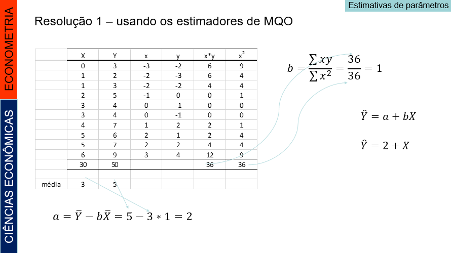
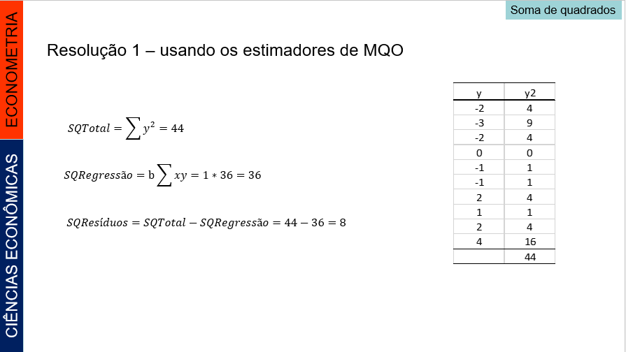

# Tópico 1 - Regressão Linear Simples: Revisão


## Introdução


</p> Regressões lineares (linhas retas) entre duas variáveis quantitativas são fáceis de compreender e bastante comuns. 

</p> Vocês já viram que a correlação mede a direção e a intensidade dessa relação entre duas variáveis. 

</p> Uma reta de regressão também resume a relação entre duas variáveis, mas apenas em uma situação específica: quando uma das variáveis ajuda a explicar ou a predizer a outra.

</p> O termo regressão foi introduzido por Francis Galton (1822-1911). Ele estudou o fenômeno da hereditariedade e mostrou que, quando casais altos ou baixos têm filhos, as alturas destes tendem a regredir, ou reverter para uma altura média mais típica.

</p> Os modelos de regressão são largamente utilizados em todas as áreas do conhecimento, tais como: computação, administração, engenharias, biologia, agronomia, CIÊNCIAS ECONÔMICAS, saúde, sociologia, etc. 


```{r , fig.cap='Exemplo 01', out.width = '50%', fig.align = 'center'}


```


```{r , fig.cap='Exemplo 02', out.width = '50%', fig.align = 'center'}


```

```{r , fig.cap='Exemplo 03', out.width = '50%', fig.align = 'center'}


```


```{r , fig.cap='Exemplo 04', out.width = '50%', fig.align = 'center'}


```


## O modelo estatístico de uma Regressão Linear Simples


</p> Dados *n* pares de valores de duas variáveis, X~i~, Y~i~ (com i = 1, 2,..., *n*), se admitirmos que *Y* é função linear de *X*, podemos estabelecer uma regressão linear simples, cujo modelo estatístico é:


$$Y_i= \alpha + \beta X_i + u_i$$

</p> onde *α* e *β*  são parâmetros, *X* é a variável explanatória e *Y* é a variável dependente.


</p> O coeficiente angular da reta (*β*) é também denominado coeficiente de regressão e o coeficiente linear da reta (α) é também conhecido como termo constante da equação de regressão. 

</p> Obs.: a análise de regressão também pode ser aplicada às relações não-lineares. Inicialmente, estudaremos apenas o caso da reta. Veremos adiante o caso das relações não-lineares. 


### Pressuposições do Modelo


</p> Ao estabelecer o modelo de regressão linear simples, pressupomos que:

</p> I) A relação entre *X* e *Y* é linear.
</p> II) Os valores de *X* são fixos, isto é, *X* não é uma variável aleatória. 
</p> III) A média do erro é nula, isto é, E(u~i~) = 0.
</p> IV) Para um dado valor de *X*, a variância do erro *u* é sempre σ^2^, denominada variância residual, isto é,

$$E(u^2)= σ^2$$
</p> ou         

$$ E[Y_i – E(Y_i | X_i)]^2 = σ^2$$ 

</p> Dizemos então, que o erro é homocedástico ou que temos homocedasticia (do erro ou da variável dependente).


</p> V) O erro de uma observação é não correlacionado com o erro em outra observação, isto é, E(*u*~i~, *u*~j~) = 0 para *i* ≠ *j*.
</p> VI) Os erros tem distribuição normal.


</p> Combinando as pressuposições III, IV e VI, temos que: u~i~ ~ N (0, σ^2^)


</p> Devemos, ainda, verificar se o número de observações disponíveis é maior do que o número de parâmetros da equação de regressão. Para ajustar uma regressão linear simples precisamos ter, no mínimo, 3 observações. 


### Estimativas dos parâmetros

</p> O primeiro passo, na análise de regressão, é obter as estimativas *a* e *b* dos parâmetros *α* e *β* da regressão. Os valores dessas estimativas serão obtidos a partir de uma amostra de *n* pares de valores X~i~, Y~i~ (com *i* = 1, 2,..., *n*), que correspondem a *n* pontos num gráfico.

</p> Obtemos, então:

$$ \ \widehat{Y_i} = a + bX_i $$

</p> Em que Y~i, *a* e *b* são, respectivamente, estimativas de *α* e *β* 


</p> Estimadores de *α* e *β*:

$$ b = \frac{\sum_{i=1}^{n}xy}{\sum_{i=1}^{n}x^2} $$
$$ a =  \ \overline{Y} - b \ \overline{X} $$

### Um exemplo numérico

</p>  Para exemplificar, consideremos a amostra de 10 pares de valores X~i~, Y~i~, da Tabela 1.1, para obtenção dos parâmetros do modelo e análise variância


|     X    	|     Y    	|
|:--------:	|:--------:	|
|     0    	|     3    	|
|     1    	|     2    	|
|     1    	|     3    	|
|     2    	|     5    	|
|     3    	|     4    	|
|     3    	|     4    	|
|     4    	|     7    	|
|     5    	|     6    	|
|     5    	|     7    	|
|     6    	|     9    	|

#### Resolução 1 – usando os estimadores de MQO 


```{r , fig.cap='Resolução estimadores MQO - parte 1', out.width = '80%', fig.align = 'center'}



```


```{r , fig.cap='Resolução estimadores MQO - parte 2', out.width = '80%', fig.align = 'center'}



```
