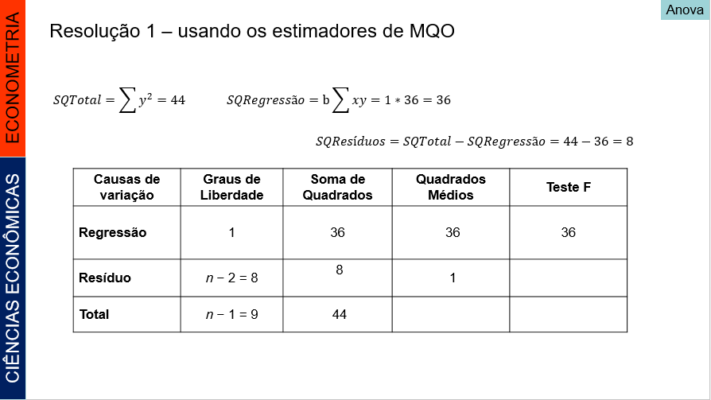
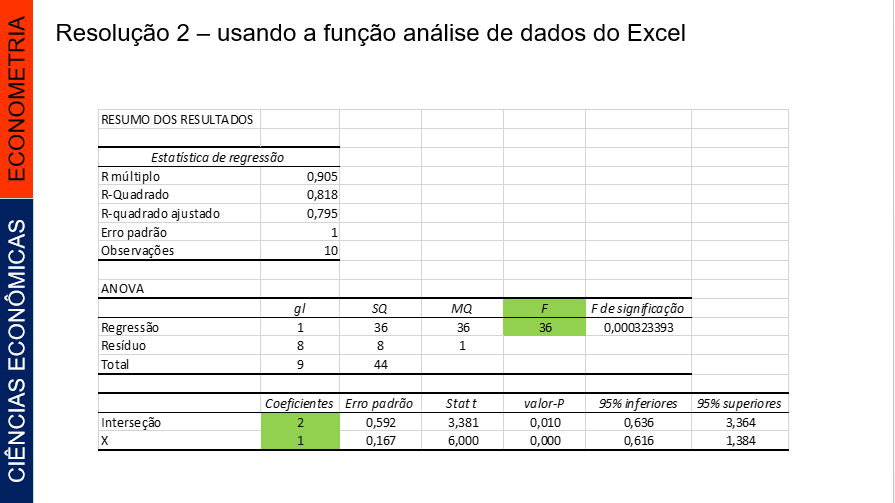

# Tópico 1 - Regressão Linear Simples: Revisão


## Introdução


</p> Regressões lineares (linhas retas) entre duas variáveis quantitativas são fáceis de compreender e bastante comuns. 

</p> Vocês já viram que a correlação mede a direção e a intensidade dessa relação entre duas variáveis. 

</p> Uma reta de regressão também resume a relação entre duas variáveis, mas apenas em uma situação específica: quando uma das variáveis ajuda a explicar ou a predizer a outra.

</p> O termo regressão foi introduzido por Francis Galton (1822-1911). Ele estudou o fenômeno da hereditariedade e mostrou que, quando casais altos ou baixos têm filhos, as alturas destes tendem a regredir, ou reverter para uma altura média mais típica.

</p> Os modelos de regressão são largamente utilizados em todas as áreas do conhecimento, tais como: computação, administração, engenharias, biologia, agronomia, CIÊNCIAS ECONÔMICAS, saúde, sociologia, etc. 


```{r , fig.cap='Exemplo 01', out.width = '50%', fig.align = 'center'}


```


```{r , fig.cap='Exemplo 02', out.width = '50%', fig.align = 'center'}

knitr::include_graphics("imagem2.png")

```

```{r , fig.cap='Exemplo 03', out.width = '50%', fig.align = 'center'}


```


```{r , fig.cap='Exemplo 04', out.width = '50%', fig.align = 'center'}


```


## O modelo estatístico de uma Regressão Linear Simples


</p> Dados *n* pares de valores de duas variáveis, X~i~, Y~i~ (com i = 1, 2,..., *n*), se admitirmos que *Y* é função linear de *X*, podemos estabelecer uma regressão linear simples, cujo modelo estatístico é:


$$Y_i= \alpha + \beta X_i + u_i$$

</p> onde *α* e *β*  são parâmetros, *X* é a variável explanatória e *Y* é a variável dependente.


</p> O coeficiente angular da reta (*β*) é também denominado coeficiente de regressão e o coeficiente linear da reta (α) é também conhecido como termo constante da equação de regressão. 

</p> Obs.: a análise de regressão também pode ser aplicada às relações não-lineares. Inicialmente, estudaremos apenas o caso da reta. Veremos adiante o caso das relações não-lineares. 


### Pressuposições do Modelo


</p> Ao estabelecer o modelo de regressão linear simples, pressupomos que:

</p> I) A relação entre *X* e *Y* é linear.
</p> II) Os valores de *X* são fixos, isto é, *X* não é uma variável aleatória. 
</p> III) A média do erro é nula, isto é, E(u~i~) = 0.
</p> IV) Para um dado valor de *X*, a variância do erro *u* é sempre σ^2^, denominada variância residual, isto é,

$$E(u^2)= σ^2$$
</p> ou         

$$ E[Y_i – E(Y_i | X_i)]^2 = σ^2$$ 

</p> Dizemos então, que o erro é homocedástico ou que temos homocedasticia (do erro ou da variável dependente).


</p> V) O erro de uma observação é não correlacionado com o erro em outra observação, isto é, E(*u*~i~, *u*~j~) = 0 para *i* ≠ *j*.
</p> VI) Os erros tem distribuição normal.


</p> Combinando as pressuposições III, IV e VI, temos que: u~i~ ~ N (0, σ^2^)


</p> Devemos, ainda, verificar se o número de observações disponíveis é maior do que o número de parâmetros da equação de regressão. Para ajustar uma regressão linear simples precisamos ter, no mínimo, 3 observações. 


### Estimativas dos parâmetros

</p> O primeiro passo, na análise de regressão, é obter as estimativas *a* e *b* dos parâmetros *α* e *β* da regressão. Os valores dessas estimativas serão obtidos a partir de uma amostra de *n* pares de valores X~i~, Y~i~ (com *i* = 1, 2,..., *n*), que correspondem a *n* pontos num gráfico.

</p> Obtemos, então:

$$ \ \widehat{Y_i} = a + bX_i $$

</p> Em que Y~i, *a* e *b* são, respectivamente, estimativas de *α* e *β* 


</p> Estimadores de *α* e *β*:

$$ b = \frac{\sum_{i=1}^{n}xy}{\sum_{i=1}^{n}x^2} $$
$$ a =  \ \overline{Y} - b \ \overline{X} $$

### Um exemplo numérico

</p>  Para exemplificar, consideremos a amostra de 10 pares de valores X~i~, Y~i~, da Tabela 1.1, para obtenção dos parâmetros do modelo e análise variância


|     X    	|     Y    	|
|:--------:	|:--------:	|
|     0    	|     3    	|
|     1    	|     2    	|
|     1    	|     3    	|
|     2    	|     5    	|
|     3    	|     4    	|
|     3    	|     4    	|
|     4    	|     7    	|
|     5    	|     6    	|
|     5    	|     7    	|
|     6    	|     9    	|

#### Resolução 1 – usando os estimadores de MQO 


```{r , fig.cap='Resolução estimadores MQO - parte 1', out.width = '80%', fig.align = 'center'}


```


```{r , fig.cap='Resolução estimadores MQO - parte 2', out.width = '80%', fig.align = 'center'}


```


```{r , fig.cap='Resolução estimadores MQO - parte 2', out.width = '80%', fig.align = 'center'}



```


#### Resolução 2 – usando a função análise de dados do Excel 


```{r , fig.cap='Resolução Excel - parte 2', out.width = '80%', fig.align = 'center'}



```


#### Resolução 3 – usando o R


```{R, warning = FALSE, message = FALSE, dpi = 500, results = "assis"}

# abrindo o arquivo do exemplo 1 do Tópico 1

ex1_top1 = read.csv2("C:/Users/Fabiola/Documents/CURSOS R/AULAS/NOTAS_SLIDES/tab1_top1.csv")

# As variáveis X e Y foram lidas corretamente como numéricas

# modelo do exercício 1


modelo1_top1 = lm(Y~X, data=ex1_top1) 
summary(modelo1_top1)


```


### Exemplo 2 (Gujarati - usados nas aulas de agosto)


</p> Exercício 5.5 do GUJARATI e PORTER (2011, p. 156): A Tabela 5.5 (tab2_top1.csv) apresenta dados sobre a remuneração anual (salário médio em dólares) dos professores e as despesas por aluno das escolas (em dólares) no ano de 1985 em 50 Estados e no distrito de Columbia. 

</p> Para verificar se há alguma relação entre a remuneração dos professores e as despesas por aluno nas escolas públicas, sugeriu-se o seguinte modelo: 

$$ Rem_i = b_1 + b_2Gast + u_i$$

</p> em que:

</p>  Rem representa o salário dos professores e Gast, as despesas por aluno.

</p> Interprete os resultados da regressão. Faz sentido do ponto de vista econômico?


```{R, warning = FALSE, message = FALSE, dpi = 500, results = "assis"}

ex2_top1 = read.csv2("C:/Users/Fabiola/Documents/CURSOS R/AULAS/NOTAS_SLIDES/tab2_top1.csv")

modelo2_top1 = lm(rem~gast, data=ex2_top1) 
summary(modelo2_top1)

options(scipen = 999)

```

</p> Interpretação: sim, faz sentido do ponto de vista econômico, já que o *β*= 3,3076 indica uma relação de causalidade positiva entre depesas por aluno e remuneração dos docentes. Além isso, a cada uma unidade adicional com gasto por aluno, se reflete num aumento de 3,3 unidades na remuneração dos professores.


### Exercício de Revisão 1 (usado na aula de 06/10/2020)


</p> É dada uma amostra de 5 pares de valores:


|     X    	|       Y     	|
|:--------:	|:-----------:	|
|     1    	|       3     	|
|     2    	|      7.5    	|
|     3    	|       7     	|
|     4    	|     11.5    	|
|     5    	|      11     	|

Admite-se que as variáveis X e Y estão relacionadas de acordo com o modelo:  

$$ Y_i = \alpha +  + \beta X_i  + u_i$$

e que são válidas as pressuposições usuais a respeito dos erros.
 

</p> **a)** Determine as estimativas dos parâmetros da regressão linear.


Admite-se que as variáveis X e Y estão relacionadas de acordo com o modelo:  

$$ \ \widehat{Y_i} = 2  + 2X_i  + u_i$$

</p> O modelo ajustado gerou um coeficiente linear igual a 2, o que significa que se X = 0, Y será igual a 2. Além disso, o coeficiente de regressão (ou coeficiente angular) estimado é igual 2, o que implica que se houver o aumento de 1 unidade na variável X, espera-se um aumento de 2 unidades na variável dependente Y.


</p> **b)** Calcule o coeficiente de determinação.

</p> Pela saída de resultados, verifica-se que que:

$$ r^2 = \frac{SQRegressão}{SQTotal}=0,8421$$
</p> Se r^2 = 0,8421, constata-se que 84,21% das variações de Y são explicadas pelas variações de X. 


</p> **c)** Faça análise variância do modelo.


</p> Com F-statistic = 16 e p-value: 0.02801, podemos inferir que o modelo é significativo ao nível de 95% de Confiança. Mas não é significativo ao nível de 99%.


```{R, warning = FALSE, message = FALSE, dpi = 500, results = "assis"}

ex3_top1 = read.csv2("C:/Users/Fabiola/Documents/CURSOS R/AULAS/NOTAS_SLIDES/tab3_top1.csv")

modelo3_top1 = lm(Y~X, data=ex3_top1) 
summary(modelo3_top1)


```

